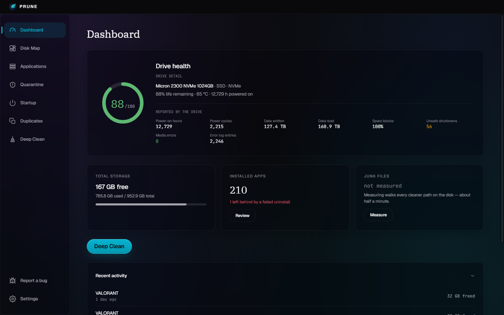
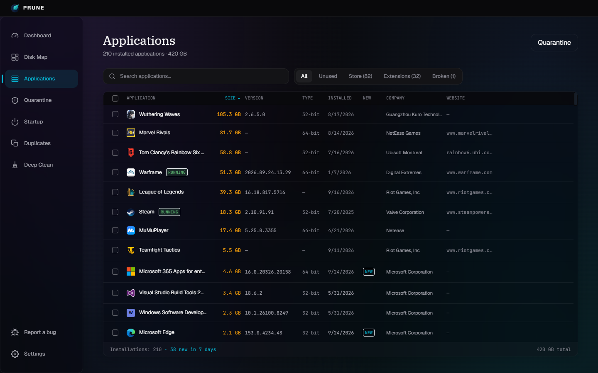
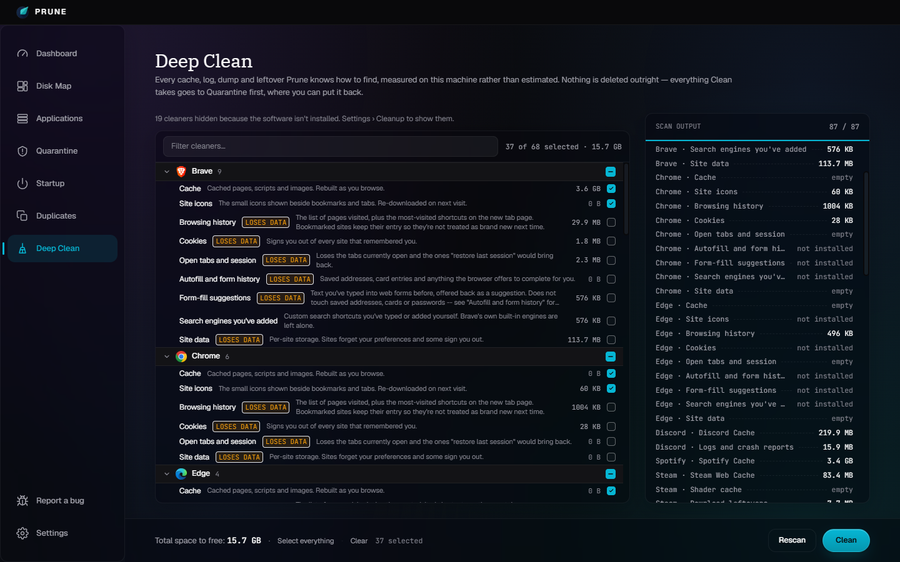
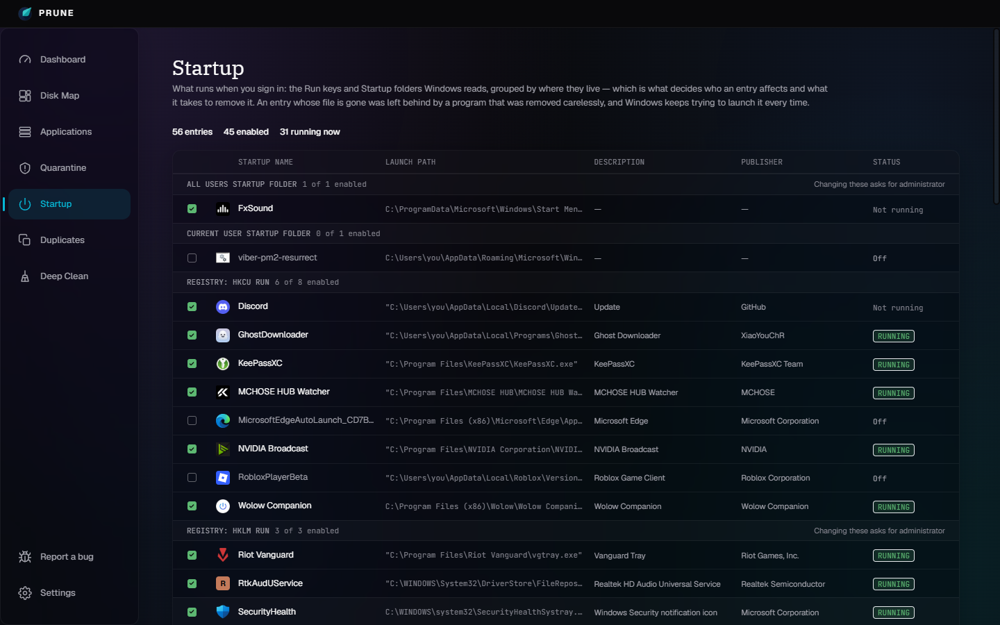
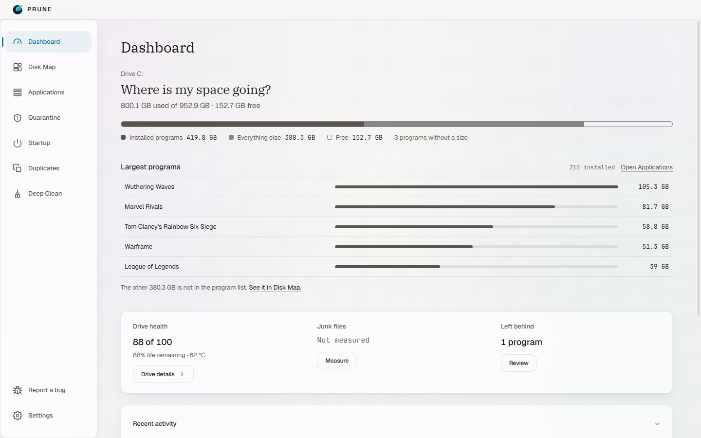

<div align="center">


# Prune

**A Windows uninstaller that finishes the job.**

Runs a program's own uninstaller, then finds what it left behind — files,
registry keys, scheduled tasks — and removes those too. By default nothing is
deleted outright: it is quarantined first, so a bad match is recoverable.

<br/>

[](https://github.com/jimman0I/prune/releases/latest)

[](LICENSE)
[](https://github.com/jimman0I/prune/actions/workflows/build.yml)


<br/>

<picture>
  <source media="(prefers-color-scheme: dark)" srcset="docs/screenshots/dashboard-dark.png" />
  <source media="(prefers-color-scheme: light)" srcset="docs/screenshots/dashboard-light.png" />
  
</picture>

<sub>Real SMART data from the drive itself — not free space dressed up as health.<br/>
This README's screenshot follows your theme, because the app does too.</sub>

</div>

<br/>

## Why it exists

Windows' own "Apps &amp; features" runs an uninstaller and stops there. What
the uninstaller forgets — a folder in `AppData`, a `Run` key, a scheduled
task — stays on the disk forever, and nothing in Windows will ever mention
it again.

Prune replaces four tools with one: an uninstaller, a disk visualiser, a
cache cleaner and a drive-health monitor. Every number it shows is measured
on the machine rather than estimated, and it says so when it cannot measure
something instead of printing a confident zero.

<br/>

## What it does

<table>
<tr>
<td width="50%" valign="top">

### 🗑️ Applications

Every installed program from all three registry Uninstall hives, plus the
Store apps and browser extensions no uninstall list mentions. Real icons,
measured sizes, and a warning before removing something that is running.
Batches run without a wizard per program — the vendor's own silent command
where one is published, and the right flag for MSI, NSIS, Squirrel and
closed Chromium browsers otherwise — and a game is removed before the launcher it uninstalls
through. Store apps are removed in-app too, one at a time or in a batch.
Optional, as in Revo: a restore point or a full registry backup before each
uninstall, and a choice of where leftover files go.

</td>
<td width="50%" valign="top">

### 🧹 Deep Clean

74 rules across 29 categories, scanned one at a time so the tree fills in as
it goes. A rule that cannot be measured says whether the software is missing
or the read needs admin — never `0 B`.

</td>
</tr>
<tr>
<td width="50%" valign="top">

### 🗺️ Disk Map

An interactive treemap of what is actually using the disk, from a full-drive
scan that reads the NTFS MFT directly. Largest files, a folder table and a
breakdown by type beside the map.

</td>
<td width="50%" valign="top">

### ⚡ Startup

Everything Windows launches at sign-in — Run keys, Startup folders,
scheduled tasks, automatic services and Store startup tasks. The switch
writes the same record Task Manager does.

</td>
</tr>
<tr>
<td width="50%" valign="top">

### 🛟 Quarantine

Files are moved and registry keys exported before removal, browsable and
restorable — nothing is gone for good until you say so twice. Leftover files
can go to the Recycle Bin or be deleted outright instead, if you choose that
in Settings; registry keys are backed up either way.

</td>
<td width="50%" valign="top">

### 🫧 Duplicates

Duplicate files under a folder you choose, found by size, then a 64 KB
sample, then a full hash — so almost nothing is read completely.

</td>
</tr>
</table>

<br/>

## Screens

<table>
<tr>
<td width="50%"></td>
<td width="50%"></td>
</tr>
<tr>
<td align="center"><b>Applications</b><br/><sub>Every hive, plus Store apps and extensions</sub></td>
<td align="center"><b>Deep Clean</b><br/><sub>Rules that lose something are marked, and never ticked by default</sub></td>
</tr>
<tr>
<td width="50%"></td>
<td width="50%"></td>
</tr>
<tr>
<td align="center"><b>Startup</b><br/><sub>Grouped by where an entry lives, because that decides how to remove it</sub></td>
<td align="center"><b>Light theme</b><br/><sub>Measured against every surface, not inverted</sub></td>
</tr>
</table>

<br/>

## Installing

Download `Prune.Setup.<version>.exe` from the
[latest release](https://github.com/jimman0I/prune/releases/latest) and run
it. The `-win.zip` beside it is the same application without an installer:
unzip it anywhere and run `Prune.exe`.

### Windows will warn you, and here is why

Prune is **not code-signed**, so the first time you run the installer
Windows shows:

> **Windows protected your PC**
> Microsoft Defender SmartScreen prevented an unrecognised app from
> starting.

Click **More info**, then **Run anyway**.

This warning is about the absence of a certificate, not about anything
found in the file. SmartScreen flags every unsigned installer it has not
seen before, and unlike a reputation warning it does not go away as more
people download it — an unsigned binary stays unrecognised. A code-signing
certificate is a paid, identity-verified purchase, and Prune does not have
one.

You do not have to take that on trust. Every release lists the SHA-256 of
both files, and you can check the one you downloaded matches before you
run it:

```powershell
Get-FileHash .\Prune.Setup.*.exe -Algorithm SHA256
```

Compare the result with `SHA256SUMS.txt` on the release page. Two things
about that file look like mismatches and are not:

- `Get-FileHash` prints the digest in **uppercase** and the file lists it
  in lowercase. Same hash — compare them case-insensitively.
- The file names the installer `Prune Setup <version>.exe`, with spaces,
  because that is what the build produced. GitHub replaces spaces with
  dots in release assets, so the file you downloaded is
  `Prune.Setup.<version>.exe`. Same file — the hash is what identifies it.

Be clear about what that does and does not prove: it confirms the file
reached you byte-for-byte as it was built, so a corrupted or altered
download is caught. It does **not** prove who built it — only a signature
does that, and there isn't one.

If you would rather not run an unsigned binary, the alternative is to
build it yourself from source: see [Building an installer](#building-an-installer)
below. The result is the same application.

<br/>

## Nothing leaves the machine

No telemetry, no crash reporting, no analytics, and no update check unless
you turn one on. The only HTTP in the app is the window talking to its own
backend on `127.0.0.1`, behind a guard that checks the `Host` header before
a request body is ever parsed — because loopback is not the protection it
sounds like, and every web page you have open can reach it too.

The one exception is opt-in: **Settings → Check for updates**, off by
default. Turned on, Prune asks `api.github.com` once a day whether a newer
release exists, sending a User-Agent and nothing else, and shows a link if
there is one. It never downloads or installs anything.

That is checkable rather than a promise: there is no `autoUpdater`, and the
only code that opens a connection to a host that is not loopback is
`backend/src/services/updateCheck.js`, which is never called while that
setting is off.

<br/>

## Requirements

- Windows 10 or 11.
- Node.js 18+ (development only — the packaged app bundles its own runtime
  via Electron).

## Development

```bash
# Backend (Express, port 3101)
cd backend
npm install
npm run dev

# Frontend (Vite, port 5174) — in a second terminal
cd frontend
npm install
npm run dev

# Electron shell — in a third terminal, once both of the above are running
cd electron
npm install
npm start
```

Run tests:

```bash
cd backend && npm test
cd frontend && npm test
```

1,844 tests, roughly half a minute per suite. GitHub Actions runs both on
every push and pull request, but run them yourself before pushing — one at
a time, for the reason [CONTRIBUTING.md](CONTRIBUTING.md) explains.

## Building an installer

```bash
cd electron
npm run dist
```

Produces an NSIS installer (`.exe`), a portable `.zip` and a generated
`SHA256SUMS.txt` in `electron/dist/`. See
[electron/README.md](electron/README.md) for how the build pipeline works
and what it does differently from a plain `electron-builder` call, and
[RELEASING.md](RELEASING.md) for the checklist around it. Published
releases are built by GitHub Actions rather than on anyone's machine, so
each file carries an attestation of where it came from.

## Architecture

- `backend/` — Express (ESM), running in-process inside Electron's main
  process when packaged, or standalone via `node src/index.js` in
  development. **Zero native dependencies**: the registry reader and the
  PowerShell COM interop used for Recycle Bin sizing both shell out to
  `reg.exe` and `powershell.exe` — binaries every Windows machine already
  has, nothing to bundle or rebuild per platform.
- `frontend/` — React + Vite + Tailwind, the Aurora Deck design system
  (obsidian ground, cyan accent, glass panels), in dark and light. Both
  palettes are CSS custom properties in `src/index.css`, and every text
  tier in each is measured against the surfaces it sits on.
- `electron/` — the desktop shell. Quarantine data and settings live under
  `app.getPath('userData')`, never inside the install directory, so an
  upgrade never touches or deletes them.

## Known limitations

- Windows only.
- Removing a Store app cannot be undone from Quarantine, unlike everything
  else Prune removes: `Remove-AppxPackage` takes the app and its data, and
  the way back is reinstalling from the Store. The dialog says so before
  you confirm.
- Store apps Windows marks as part of the system — the Security interface,
  the app installer — cannot be removed, and their rows open Windows' own
  page instead. A batch takes only the Store apps Windows explicitly marks
  as removable; one it has not said either way stays out.
- About one program in ten still uninstalls with its own wizard: anything
  whose installer Prune cannot positively identify runs exactly as
  registered, because a wrong silent flag is worse than a visible dialog.
- A Chromium browser that is open when its uninstall runs shows its own
  dialog rather than being closed for you — the silent option closes every
  window without asking. Microsoft Edge and the WebView2 runtime always
  show Microsoft's dialog: other programs, Windows Search among them,
  depend on WebView2.
- Leftover scanning is heuristic (name and publisher matching), not a full
  before/after filesystem snapshot.
- **Delete permanently**, if you choose it for leftover files in Settings,
  means exactly that: they cannot be restored from Quarantine or the
  Recycle Bin. It is off by default, the review says so before you confirm,
  and a guard refuses Windows, a drive root, Program Files itself, your
  profile's own folders and Prune's quarantine whatever the scan found.
- A full registry backup before uninstalling covers `HKLM\SOFTWARE` and
  `HKCU\Software` — about 140 MB here — and only the newest three are kept.
- The installer is unsigned, so SmartScreen warns on first run and keeps
  warning — see [Installing](#installing).

<br/>

## Contributing and security

- [CONTRIBUTING.md](CONTRIBUTING.md) — how to run it, how code is written
  here, and how to work on the parts that delete things without deleting
  your own.
- [SECURITY.md](SECURITY.md) — where to report a vulnerability privately,
  and what is in scope.
- [RELEASING.md](RELEASING.md) — the release checklist.
- [CHANGELOG.md](CHANGELOG.md) — release notes.

## License

MIT — see [LICENSE](LICENSE). Use it, fork it, sell it; keep the copyright
notice. It comes with no warranty, which is worth reading rather than
skipping for a program whose job is deleting things.
