<div align="center">

<picture>
  <source media="(prefers-color-scheme: dark)" srcset="docs/screenshots/dashboard-dark.png" />
  <source media="(prefers-color-scheme: light)" srcset="docs/screenshots/dashboard-light.png" />
  
</picture>

<br/>
<br/>


# ✂️ Prune — The Uninstaller That Finishes the Job



<br/>

[](https://github.com/jimman0I/prune/releases/latest)
[](https://github.com/jimman0I/prune/releases)

[](LICENSE)
[](https://github.com/jimman0I/prune/actions/workflows/build.yml)


<br/>

**87 cleaner rules** · **31 categories** · **40 languages** · **0 telemetry** · **100% local**

[**⬇️ Download for Windows**](https://github.com/jimman0I/prune/releases/latest) &nbsp;·&nbsp; [Quick start](#quick-start) &nbsp;·&nbsp; [What sets it apart](#what-sets-prune-apart) &nbsp;·&nbsp; [Report a bug](https://github.com/jimman0I/prune/issues/new)

</div>

<br/>

> Windows' own "Apps &amp; features" runs an uninstaller and stops there. What
> the uninstaller forgets — a folder in `AppData`, a `Run` key, a scheduled
> task — stays on your disk forever, and nothing in Windows will ever mention
> it again. **Prune runs the uninstaller, then goes looking for the rest.**

It replaces four tools with one: an **uninstaller**, a **disk visualiser**, a
**cache cleaner** and a **drive-health monitor**. Every number it shows is
measured on your machine rather than estimated, and when it cannot measure
something it says so instead of printing a confident zero.

<div align="center">

### ⭐ If Prune freed your disk, star the repo — it helps others find it.

[](https://github.com/jimman0I/prune)

</div>

<br/>

<a id="what-sets-prune-apart"></a>

## 🏆 What Sets Prune Apart

| | Windows "Apps & features" | Typical cleaner | **Prune** |
| --- | :---: | :---: | :---: |
| Runs the program's own uninstaller | ✅ | ❌ | ✅ |
| Finds leftover files, registry keys and tasks | ❌ | ⚠️ guesses | ✅ scanned per program |
| Removes leftovers **recoverably** | — | ❌ deletes outright | ✅ quarantined first |
| Batch uninstall without a wizard per program | ❌ | ❌ | ✅ silent where safe |
| Shows what a cleaner rule would *actually* free | — | ⚠️ estimates | ✅ measured on disk |
| Hides cleaners for software you don't have | — | ❌ | ✅ on by default |
| Real SMART drive health | ❌ | ⚠️ free space as "health" | ✅ from the drive |
| Sends data anywhere | — | often | **never** (update check is opt-in) |

<br/>

## 🎬 How an Uninstall Works



A bad match is recoverable by design: by default **nothing is deleted
outright** — it is moved to Quarantine first.

<br/>

## ✨ What It Does

<table>
<tr>
<td width="50%" valign="top">

### 🗑️ Applications

Every installed program from all three registry Uninstall hives, plus the
Store apps and browser extensions no uninstall list mentions. Real icons,
measured sizes, and a warning before removing something that is running.

Batches run without a wizard per program — the vendor's own silent command
where one is published, and the right flag for MSI, NSIS, Squirrel and
closed Chromium browsers otherwise — and a game is removed before the
launcher it uninstalls through. Optional, as in Revo: a restore point or a
full registry backup before each uninstall, and a choice of where leftover
files go.

</td>
<td width="50%" valign="top">

### 🧹 Deep Clean

**87 rules across 31 categories**, scanned one at a time so the tree fills
in as it goes. A rule that cannot be measured says whether the software is
missing or the read needs admin — never `0 B`.

Cleaners for software that isn't installed are hidden, and rules that lose
something (history, cookies, sessions) are marked and never ticked by
default. Includes Windows Defender and WinRAR cleaners.

</td>
</tr>
<tr>
<td width="50%" valign="top">

### 🗺️ Disk Map

An interactive treemap of what is actually using the disk, from a
full-drive scan that reads the NTFS MFT directly (the way WizTree does).
Largest files, a folder table and a breakdown by type beside the map.

Scans show real progress and time left: files scanned and bytes processed
as they happen, and — for a whole-drive walk of `C:` — a percentage that is
a true ratio of bytes read to bytes in use. Where no total is known there is
no percentage, only a moving bar. Motion respects Windows' reduce-motion
setting.

</td>
<td width="50%" valign="top">

### 💽 Drive Health

The dashboard's health score is about **your drive and nothing else**: real
SMART data — wear, power-on hours, media and uncorrected errors — read from
the drive itself. A drive that reports errors lands in the red whatever its
wear life. Free space and broken apps have their own cards; they don't
dilute the score.

</td>
</tr>
<tr>
<td width="50%" valign="top">

### ⚡ Startup

Everything Windows launches at sign-in — Run keys, Startup folders,
scheduled tasks, automatic services and Store startup tasks. The switch
writes the same record Task Manager does.

</td>
<td width="50%" valign="top">

### 🛟 Quarantine

Files are moved and registry keys exported before removal, browsable and
restorable — nothing is gone for good until you say so twice. Leftover
files can go to the Recycle Bin or be deleted outright instead, if you
choose that in Settings; registry keys are backed up either way.

</td>
</tr>
<tr>
<td width="50%" valign="top">

### 🫧 Duplicates

Duplicate files under a folder you choose, found by size, then a 64 KB
sample, then a full hash — so almost nothing is read completely.

</td>
<td width="50%" valign="top">

### 🐞 Report a Bug

A button in the side bar and in Settings → About opens a **prefilled GitHub
issue**. You see exactly what will be included — your words plus Prune's
version, Windows' version and the architecture, nothing else — before
anything leaves the app.

</td>
</tr>
</table>

<br/>

## 🖼️ Screens

<table>
<tr>
<td width="50%"></td>
<td width="50%"></td>
</tr>
<tr>
<td align="center"><b>Applications</b><br/><sub>Every hive, plus Store apps and extensions</sub></td>
<td align="center"><b>Deep Clean</b><br/><sub>Measured sizes; rules that lose something are marked and never ticked by default</sub></td>
</tr>
<tr>
<td width="50%"></td>
<td width="50%"></td>
</tr>
<tr>
<td align="center"><b>Startup</b><br/><sub>Grouped by where an entry lives, because that decides how to remove it</sub></td>
<td align="center"><b>Light &amp; dark</b><br/><sub>System, Light or Dark — each measured against every surface, not inverted</sub></td>
</tr>
</table>

<br/>

## 🔒 Private &amp; Local-First



No telemetry, no crash reporting, no analytics, and **no update check unless
you turn one on**. The only HTTP in the app is the window talking to its own
backend on `127.0.0.1`, behind a guard that checks the `Host` header before a
request body is ever parsed — because loopback is not the protection it
sounds like, and every web page you have open can reach it too.

The one exception is opt-in: **Settings → Check for updates**, off by
default. Turned on, Prune asks `api.github.com` once a day whether a newer
release exists, sending a User-Agent and nothing else. If there is one, a
button appears at the bottom of the side bar, and only clicking it downloads
the new installer from the GitHub release and installs it.

That is checkable rather than a promise: the only code that opens a
connection to a host that is not loopback is
`backend/src/services/updateCheck.js` and the updater in
`electron/updater.cjs`, and neither does anything while the update check is
off. [SECURITY.md](SECURITY.md) says exactly what the updater trusts.

<br/>

## 📰 What's New in 2.8

- **Remembers where you left it** — window size and position, the Settings tab, Deep Clean's ticks and collapsed groups.
- **Batch uninstall that actually uninstalls** — a paths-with-spaces quoting bug made some uninstallers never open; fixed, with a single "ready to scan" gate.
- **Disk Map with real progress** — percent, time left and a Stop button.
- **Drive health only** on the dashboard; the CPU/memory gauges are gone. Prune is a storage tool.
- **Deep Clean hides software you don't have**, and gains Windows Defender and WinRAR cleaners.
- **Every screen reviewed against Apple's Human Interface Guidelines** — legible text, keyboard and screen-reader access, high-contrast support, zoom, System/Light/Dark theme.
- **Report a bug** button with a prefilled GitHub issue.

Full notes: [CHANGELOG.md](CHANGELOG.md).

<br/>

<a id="quick-start"></a>

# ⚡ Quick Start

1. **Download** `Prune-Setup-<version>.exe` from the [latest release](https://github.com/jimman0I/prune/releases/latest).
2. **Run it.** The installer opens in Windows' own language (40 are included) and, on a fresh install, asks whether Prune should check for updates — unticked unless you tick it.
3. **Open Prune** and pick a program under **Applications**.

The `-win.zip` beside the installer is the same application without an
installer: unzip it anywhere and run `Prune.exe`. Requires Windows 10 or 11.

From 2.5.0 on, that is the last installer you run by hand: with the update
check on, one click installs a new version and reopens Prune.

<details>
<summary><b>🛡️ Windows will warn you — here is why, and how to verify the download</b></summary>

<br/>

Prune is **not code-signed**, so the first time you run the installer
Windows shows:

> **Windows protected your PC** — Microsoft Defender SmartScreen prevented an
> unrecognised app from starting.

Click **More info**, then **Run anyway**.

This warning is about the absence of a certificate, not about anything found
in the file. SmartScreen flags every unsigned installer it has not seen
before, and unlike a reputation warning it does not go away as more people
download it. A code-signing certificate is a paid, identity-verified
purchase, and Prune does not have one.

You do not have to take that on trust. Every release lists the SHA-256 of
both files:

```powershell
Get-FileHash .\Prune-Setup-*.exe -Algorithm SHA256
```

Compare the result with `SHA256SUMS.txt` on the release page.
`Get-FileHash` prints the digest in **uppercase** and the file lists it in
lowercase — same hash, compare them case-insensitively.

That confirms the file reached you byte-for-byte as it was built. It does
**not** prove who built it. For that, releases are built by GitHub Actions
and each file carries an **attestation**: a signed record of the repository,
the commit and the workflow that produced it. With the
[GitHub CLI](https://cli.github.com/):

```powershell
gh attestation verify .\Prune-Setup-<version>.exe --repo jimman0I/prune
```

A file that passes was built by this repository's own workflow from its
public source; anything else fails. It is still not a code signature —
Windows does not read it, so SmartScreen warns all the same — but it answers
who built the file, which a checksum cannot. Releases before 2.4.1 were built
locally and have no attestation; releases before 2.5.0 named the installer
`Prune.Setup.<version>.exe` and cannot update themselves.

If you would rather not run an unsigned binary, build it yourself from
source: see [Build it yourself](#build-it-yourself). The result is the same
application.

</details>

<br/>

## 🧱 Tech Stack

| Layer | What it is |
| --- | --- |
| **Shell** | Electron — quarantine data and settings live under `app.getPath('userData')`, never inside the install directory, so an upgrade never touches them |
| **Backend** | Express (ESM), in-process inside Electron when packaged. **Zero native dependencies**: the registry reader and Recycle Bin sizing shell out to `reg.exe` and `powershell.exe`, which every Windows machine already has |
| **Frontend** | React + Vite + Tailwind — the Aurora Deck design system (obsidian ground, cyan accent, glass panels), dark and light, every text tier measured against the surfaces it sits on |
| **Tests** | 3,000+ tests across backend, frontend and electron, run by GitHub Actions on every push and pull request |
| **Releases** | Built by GitHub Actions with build attestations — see [RELEASING.md](RELEASING.md) |

<br/>

<a id="build-it-yourself"></a>

## 🛠️ Build It Yourself

Requires Node.js 18+ (development only — the packaged app bundles its own
runtime via Electron).

```bash
# Backend (Express, port 3101)
cd backend && npm install && npm run dev

# Frontend (Vite, port 5174) — in a second terminal
cd frontend && npm install && npm run dev

# Electron shell — in a third terminal, once both of the above are running
cd electron && npm install && npm start
```

Run the tests, one suite at a time (see [CONTRIBUTING.md](CONTRIBUTING.md) for why):

```bash
cd backend && npm test
cd frontend && npm test
cd electron && npm test
```

Build an installer:

```bash
cd electron && npm run dist
```

Produces an NSIS installer (`.exe`), a portable `.zip` and a generated
`SHA256SUMS.txt` in `electron/dist/`. See
[electron/README.md](electron/README.md) for the build pipeline and
[RELEASING.md](RELEASING.md) for the checklist around it.

<br/>

## ⚠️ Known Limitations

<details>
<summary>What Prune deliberately does not do, or cannot</summary>

<br/>

- Windows only.
- Removing a Store app cannot be undone from Quarantine, unlike everything
  else Prune removes: `Remove-AppxPackage` takes the app and its data, and
  the way back is reinstalling from the Store. The dialog says so before you
  confirm.
- Store apps Windows marks as part of the system — the Security interface,
  the app installer — cannot be removed, and their rows open Windows' own
  page instead.
- About one program in ten still uninstalls with its own wizard: anything
  whose installer Prune cannot positively identify runs exactly as
  registered, because a wrong silent flag is worse than a visible dialog.
- A Chromium browser that is open when its uninstall runs shows its own
  dialog rather than being closed for you. Microsoft Edge and the WebView2
  runtime always show Microsoft's dialog: other programs, Windows Search
  among them, depend on WebView2.
- Leftover scanning is heuristic (name and publisher matching), not a full
  before/after filesystem snapshot.
- **Delete permanently**, if you choose it for leftover files in Settings,
  means exactly that: they cannot be restored. It is off by default, the
  review says so before you confirm, and a guard refuses Windows, a drive
  root, Program Files itself, your profile's own folders and Prune's
  quarantine whatever the scan found.
- A full registry backup before uninstalling covers `HKLM\SOFTWARE` and
  `HKCU\Software` — about 140 MB here — and only the newest three are kept.
- The installer is unsigned, so SmartScreen warns on first run and keeps
  warning.

</details>

<br/>

## 📖 Documentation

| Doc | What's in it |
| --- | --- |
| [CHANGELOG.md](CHANGELOG.md) | Release notes, newest first |
| [CONTRIBUTING.md](CONTRIBUTING.md) | How to run it, how code is written here, and how to work on the parts that delete things without deleting your own |
| [SECURITY.md](SECURITY.md) | Where to report a vulnerability privately, and what is in scope |
| [RELEASING.md](RELEASING.md) | The release checklist |
| [electron/README.md](electron/README.md) | How the build pipeline works |

<br/>

## 🤝 Contributing &amp; Help

- 🐞 **Found a bug?** Use **Report a bug** inside Prune, or [open an issue](https://github.com/jimman0I/prune/issues/new).
- 💡 **Want a feature or a new cleaner rule?** [Open an issue](https://github.com/jimman0I/prune/issues) — rules live in `backend/src/data/cleaners.json`.
- 🔧 **Want to send a fix?** Read [CONTRIBUTING.md](CONTRIBUTING.md) first.
- 🔐 **Security issue?** Follow [SECURITY.md](SECURITY.md) — please don't post it publicly.

## 📄 License

MIT — see [LICENSE](LICENSE). Use it, fork it, sell it; keep the copyright
notice. It comes with no warranty, which is worth reading rather than
skipping for a program whose job is deleting things.
